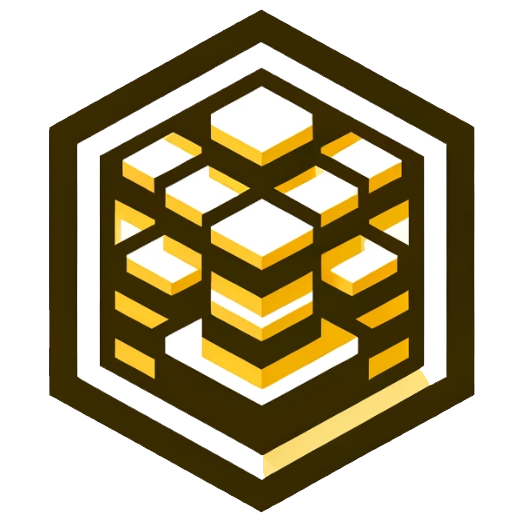

# Nidrs

致敬 Nestjs 框架，Nidrs 是参考 Nestjs 思想的 Rust 企业级模块化开发框架，同时基于 Axum 进行开发和设计。

Nidrs 提供了一个即插即用的应用程序架构，使开发人员和团队能够轻松创建高度可测试、可扩展、松散耦合且易于维护的应用程序。

> Nestjs 是一个用于构建高效，可扩展的 Node.js 服务器端应用程序的框架。它使用渐进式 JavaScript，内置并完全支持 TypeScript（但仍然允许开发人员使用纯 JavaScript 编写代码）并结合了 OOP（面向对象编程），FP（函数式编程）和 FRP（函数式响应编程）的元素。

## 特性

- [x] 模块化封装
- [x] 依赖自动注入
- [x] 分层架构
- [ ] 拦截器
- [ ] 统一错误处理
- [ ] 模块测试
- [ ] CLI 命令
- [ ] 完整的文档和例子

## 例子

### example/src/app/controller.rs

```rs
use std::collections::HashMap;

use axum::{extract::{Query, State}, Json};
use nidrs::{Inject, StateCtx};
use nidrs_macro::{controller, get, post};

use super::service::AppService;

#[controller("/app")]
#[derive(Debug, Default)]
pub struct AppController {
    app_service: Inject<AppService>,
}

impl AppController {
    #[get("/hello")]
    pub async fn get_hello_world(&self, State(state): State<StateCtx>, Query(q): Query<HashMap<String, String>>) -> String {
        println!("Query {:?}", q);
        let app_service = self.app_service.lock().unwrap();
        let app_service = app_service.as_ref().unwrap();
        app_service.get_hello_world()
    }
    #[post("/hello")]
    pub async fn get_hello_world2(&self, State(state): State<StateCtx>, Query(q): Query<HashMap<String, String>>, Json(j): Json<serde_json::Value>) -> String {
        println!("Query {:?}", q);
        println!("Json {:?}", j);

        "Hello, World2!".to_string()
    }
}

```

### example/src/app/service.rs

```rs
use nidrs::Inject;
use nidrs_macro::injectable;
use crate::user::service::UserService;

#[injectable()]
#[derive(Clone, Debug, Default)]
pub struct AppService{
    user_service: Inject<UserService>
}

impl AppService {
    pub fn get_hello_world(&self) -> String {
        let user_service = self.user_service.lock().unwrap();
        let user_service = user_service.as_ref().unwrap();
        user_service.get_hello_world()
    }

    pub fn get_hello_world2(&self) -> String {
        "Hello, nidrs2xx333!".to_string()
    }
}
```

### example/src/app/mod.rs

```rs
use nidrs_macro::module;

pub mod controller;
pub mod service;

use controller::AppController;
use service::AppService;
use crate::user::UserModule;

#[module({
    imports = [UserModule];
    controllers = [AppController];
    services = [AppService];
})]
pub struct AppModule;

```

运行例子：

```shell
git clone https://github.com/nidrs/nidrs.git
cd nidrs/example
cargo run
```

## 设计思想

整个框架的目标是提高模块复用和极致的开发便携。

框架整体是通过宏来自动收集依赖关系，并且生成服务注册、依赖注入、路由注册的相关代码。

框架初始化大概可以分为两大阶段：

    1. 模块注册
       1. 路由注册
       2. 服务注册
       3. 模块注册
    2. 依赖注入

框架在初始化的时候会创建一个核心的对象：

```rs
#[derive(Debug, Clone)]
pub struct ModuleCtx{
    pub services: Arc<Mutex<HashMap<String, Box<dyn Any>>>>,
    pub controllers: Arc<Mutex<HashMap<String, Box<dyn Any>>>>,
    pub routers: Arc<Mutex<Vec<axum::Router<StateCtx>>>>
}
```

而服务整个注册的行为就是给 `ctx.services.insert("AppService", AppService)` 插入创建的实例。

而依赖注入会将标记为 `Inject` 的属性找出来，从 `ctx.services` map 上获取实例化后的 service 赋值给对应的属性，所以目前所有的服务都是单例。

具体想看宏生成的代码可以执行 `cd nidrs/example && cargo expand` 即可。

## About

整个框架目前处于早期阶段，计划 0.x.x 都处于测试版本，正常稳定可用的是从 1.0 开始，欢迎大家试用也可以私信一起来贡献开发。

[欢迎加入 Discord](https://discord.gg/gwqKpxvUxU)

MIT
